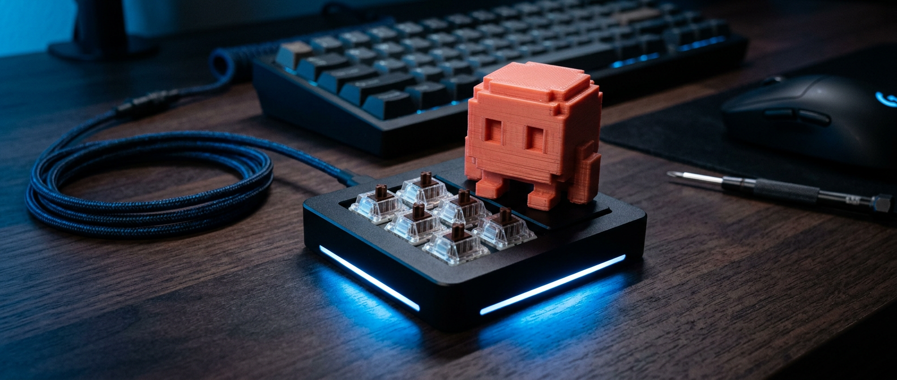

# Claude-Macropad-V2

A dedicated macropad for driving Claude Code — approve, stop, new session, navigate transcripts — with a host-driven status LED that lights up when Claude is waiting on you.

## Contents

- [`hardware-directions.md`](hardware-directions.md) — off-the-shelf vs. custom-build paths, and how to wire the status LED to Claude Code hooks.
- [`ideated-shortcuts.md`](ideated-shortcuts.md) — candidate key assignments.
- [`specs/`](specs/) — ESP32 / RP2040 build specs, ideas log, and the [BOM](specs/bom.md).
- [`assets/prototypes/`](assets/prototypes/) — visual prototypes.
